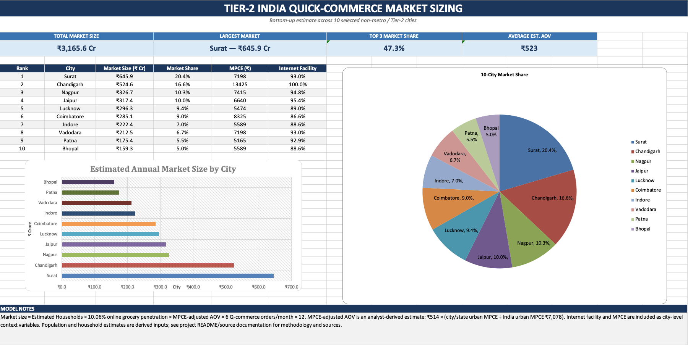

# Tier-2 India Quick-Commerce Market Sizing

## Overview

I built a bottom-up market-sizing model to estimate the potential **quick-commerce market across 10 selected Tier-2 and non-metro Indian cities**.

The objective was to identify which cities could represent the largest opportunities for quick-commerce expansion.

**Cities:** Jaipur, Lucknow, Indore, Surat, Nagpur, Vadodara, Bhopal, Patna, Coimbatore and Chandigarh.

## Business Question

> **Which selected Tier-2 Indian cities offer the largest quick-commerce market opportunity?**

The analysis looks at population, household size, purchasing power (MPCE), internet availability, online grocery adoption and Q-commerce buying behaviour.

## Methodology

The market size was estimated using a bottom-up approach:

**Population → Households → Online Grocery Households → Orders → AOV → Market Size**

### Formula

```text
Estimated Households =
Population ÷ Urban Average Household Size

Online Grocery Households =
Estimated Households × 10.06%

Annual Market Size =
Online Grocery Households
× MPCE-Adjusted AOV
× 6 Orders/Month
× 12
```

The base Q-commerce AOV is **₹514**.

A city-level MPCE adjustment was applied:

```text
MPCE-Adjusted AOV =
₹514 × (City MPCE ÷ India Urban MPCE)
```

The MPCE adjustment is an **analyst-derived assumption** used to account for differences in purchasing power.

## Key Results

### **Estimated 10-City Market: ₹3,166 Cr**

| Rank | City | Market Size | Market Share |
|---:|---|---:|---:|
| 1 | Surat | ₹645.9 Cr | 20.4% |
| 2 | Chandigarh | ₹524.6 Cr | 16.6% |
| 3 | Nagpur | ₹326.7 Cr | 10.3% |
| 4 | Jaipur | ₹317.4 Cr | 10.0% |
| 5 | Lucknow | ₹296.3 Cr | 9.4% |

**Surat, Chandigarh and Nagpur together account for 47.3% of the estimated market.**

## Dashboard




The Excel dashboard includes:

- Market size by city
- Market share
- City ranking
- MPCE vs market size
- Internet-facility comparison

**File:** `Tier2_QCommerce_Dashboard.xlsx`

## Data Sources

- **UN World Urbanization Prospects 2025** — city population
- **MoSPI PLFS 2023–24** — urban household size
- **MoSPI HCES 2023–24** — MPCE and online grocery benchmark
- **MoSPI CMS Telecom 2025** — household internet facility
- **Swiggy FY25 Annual Report** — ₹514 Q-commerce AOV
- **Redseer** — ~6 Q-commerce orders/month

Source links and detailed references are documented in the project files.

## Assumptions & Limitations

- State/UT urban statistics were used as proxies where city-level data was unavailable.
- 10.06% is an urban online-grocery benchmark, not a city-specific rate.
- ₹514 is an industry/company benchmark, not the actual AOV of every city.
- MPCE-adjusted AOV is an analyst-derived assumption.
- The model estimates **gross market opportunity**, not company revenue.

## Tools

**Microsoft Excel | Data Analysis | Market Sizing | Data Visualization | Dashboarding**
